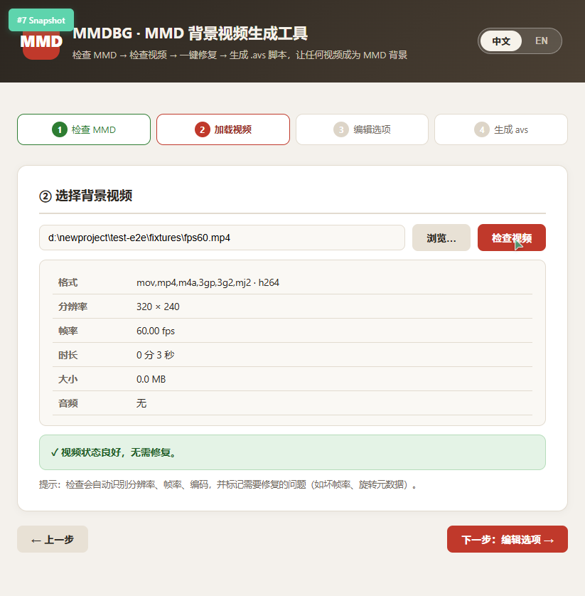
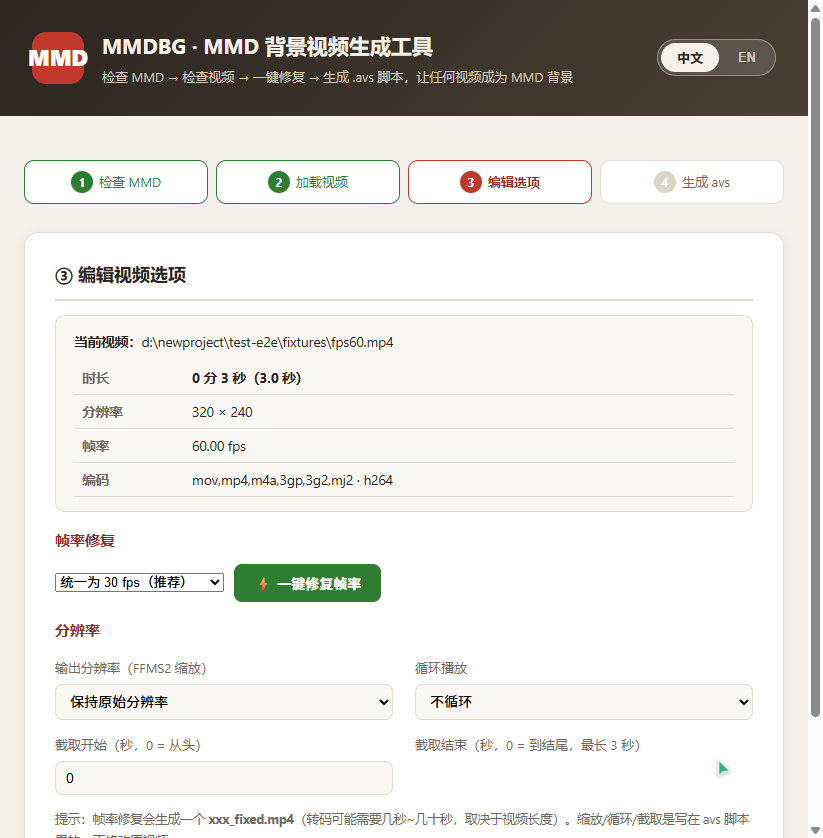
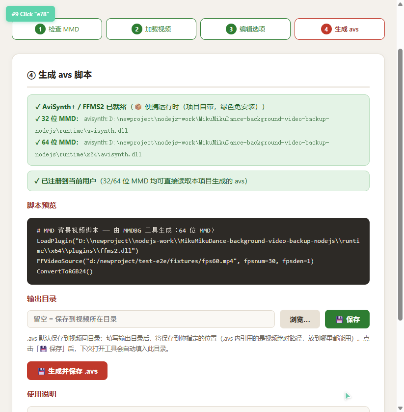
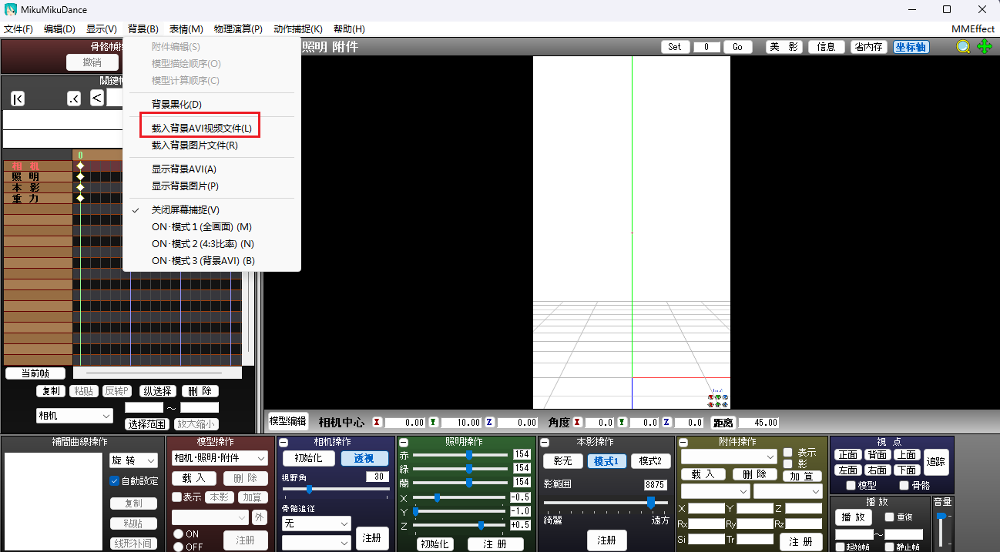
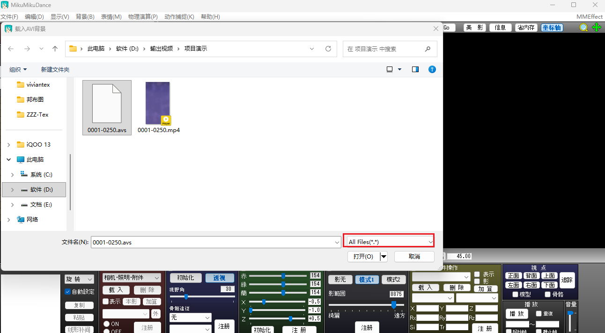
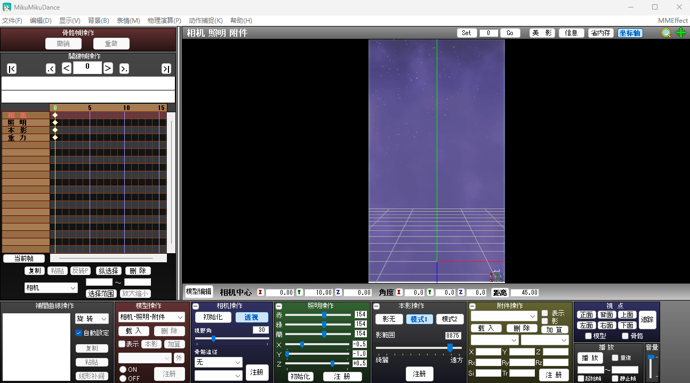

# MMDBG · MikuMikuDance Background Video

  

**[English](README_EN.md)** | 简体中文

让 MMD（MikuMikuDance）轻松加载任意视频（mp4 / mkv / avi / mov…）作为背景的可视化工具。
支持 **32 位与 64 位 MMD**，解压即用、零依赖、绿色免安装。

## 截图预览

### ① 检查 MMD —— 自动识别 32/64 位


### ② 加载视频 —— 自动检测格式 / 分辨率 / 帧率问题



### ③ 编辑选项 —— 帧率修复 / 缩放 / 循环 / 截取



### ④ 生成 .avs —— 按位数自动选择运行时



### ⑤ 在 MMD 中加载 —— Background → Load background avi file



### ⑥ 选择 .avs —— 文件类型切到 All Files (*.*) 才能看到



### ⑦ 完成 —— 视频作为背景显示在 MMD 视图中



## ✨ 绿色便携版（解压即用，零依赖）

本项目**内置完整运行时**，客户机**无需安装任何东西**（连 Node.js 都不需要）：

```
MikuMikuDance-background-video/
├── 启动工具.bat        ← 双击启动（自动打开浏览器界面）
├── server.mjs          Node.js 后端
├── public/             可视化界面（中英文切换）
├── runtime/            ★ 内置便携运行时（绿色免安装）
│   ├── node/node.exe       Node.js v24 LTS 官方二进制（免安装）
│   ├── avisynth.dll        AviSynth+ 32 位（VFW 桥接，32 位 MMD 用）
│   ├── plugins/ffms2.dll   FFMS2 32 位（FFmpeg 解码内核）
│   └── x64/                ★ 64 位 MMD 支持
│       ├── avisynth.dll    AviSynth+ 64 位（3.7.5）
│       └── plugins/ffms2.dll   FFMS2 64 位（5.0）
├── licenses/
│   ├── GPL-3.0.txt     GPL v3 全文（runtime 组件许可证）
│   └── NODEJS-MIT.txt  Node.js MIT 许可证
├── LICENSE             MIT（主代码许可证）
└── THIRD-PARTY-NOTICES.md   第三方组件声明
```

**客户只需要：** 32 位或 64 位 MMD 均可。解压 → 双击 `启动工具.bat` → 用。
（启动脚本优先使用内置 node.exe，找不到时自动回退到系统安装的 Node.js。）

首次启动时工具会**自动把便携运行时注册到当前用户注册表**（HKCU，无需管理员权限，
32/64 位一次注册全部生效），之后 MMD 读取 .avs 直接使用项目内置的 AviSynth+/FFMS2。
**删除项目文件夹即完全卸载**，不留系统残留。

> 兼容性：如果系统已安装 AviSynth+，工具会自动检测并优先使用项目内置版（版本可控、行为一致）；
> 若 runtime 文件夹缺失，则自动回退使用系统安装版。

## 使用

1. **双击 `启动工具.bat`** —— 自动启动本地服务并打开浏览器界面（http://127.0.0.1:38765）
2. **第 1 步**：选择 MMD 程序（.exe）→ 检查位数（32/64 位均支持）→ 💾 保存（下次自动填入）
3. **第 2 步**：选择背景视频 → 自动检测格式/分辨率/帧率/编码问题
4. **第 3 步**：一键修复帧率 / 缩放（含 2K/4K+风险提示）/ 循环 / 截取
   > 💡 **提示**：视频的输出分辨率最好与您准备输出 MMD 视频的分辨率一致（例如打算渲染 1080p 成品，就把背景视频缩放到 1920×1080），否则背景会被拉伸/裁剪，影响画质。
5. **第 4 步**：生成 .avs（按第 1 步检测的 MMD 位数自动选择对应运行时）→ 在 MMD 里 Background → Load background avi file → 文件类型选 All Files

## 运行要求

| 组件 | 说明 |
|---|---|
| 32 位或 64 位 MMD | 均可（工具第 1 步自动检查位数，生成对应版本的 .avs） |
| Node.js | ✅ 已内置（runtime/node/node.exe，免安装） |
| AviSynth+/FFMS2 | ✅ 已内置（runtime/ 32 位 + runtime/x64/ 64 位，自动注册） |

> ffmpeg/ffprobe 用于视频检测与转码修复，需要系统 PATH 中可用 ffmpeg，
> 或用环境变量 `MMDBG_FFMPEG` / `MMDBG_FFPROBE` 指定路径。

## 常见问题

- **MMD 读 .avs 报错/不显示**：确认第 4 步显示"已注册"；若曾手动清理注册表，点界面上的"一键注册"。
- **生成后 MMD 里看不到 .avs**：文件类型下拉必须选 "All Files (*.*)"。
- **灰屏**：先点"一键修复帧率"（手机录屏视频常有坏帧率元数据），再重新生成。
- **换用了不同位数的 MMD**：回到第 1 步重新检查 MMD，再重新生成 .avs（脚本里的 LoadPlugin 路径按位数区分，32/64 位互不通用）。
- **提示 FFMS2 位数错误**：x86 链路确认 runtime/plugins/ffms2.dll 是 32 位版（v2.40，v5.0 只有 64 位）；x64 链路确认 runtime/x64/plugins/ffms2.dll 是 64 位版。

## 技术说明

- **原理**：MMD 背景视频走 VFW 老接口 → AviSynth+ 提供 VFW 桥接 → FFMS2(FFmpeg) 解码任意格式。
- **双位数支持**：注册表 `AVIFile\Extensions\AVS` 为共享视图（写一次）；`CLSID` 键按位数重定向——
  64 位原生视图指向 `runtime\x64\avisynth.dll`（AviSynth+ 3.7.5 x64），32 位 Wow6432Node 视图指向
  `runtime\avisynth.dll`（x86）。同一注册表结构让 32/64 位 MMD 各自加载正确位数的 DLL，互不干扰。
  .avs 脚本内 `LoadPlugin` 按第 1 步检测到的 MMD 位数选择对应的 ffms2.dll。
- **便携注册**：写入 `HKCU\Software\Classes`，32/64 位 MMD 读取时 HKCU 优先于 HKLM，无需管理员权限；卸载即删除注册键。
- **配置**：`mmdbg-config.json` 保存 MMD 路径等（可删，不影响使用）。
- **端口**：默认 38765，可用环境变量 `MMDBG_PORT` 修改（被占用时自动顺延）。

## 作者

- **bilibili 用户：[我敲胡桃](https://space.bilibili.com/351710167)**
- **GLM-5.3**（[Z.ai](https://z.ai)）

## 许可证

| 部分 | 许可证 |
|---|---|
| 本项目主代码（server.mjs / public/ 等） | [MIT License](LICENSE) |
| runtime/avisynth.dll（[AviSynth+](https://github.com/AviSynth/AviSynthPlus)） | [GNU GPL v3.0](licenses/GPL-3.0.txt) |
| runtime/plugins/ffms2.dll（[FFMS2](https://github.com/FFMS/ffms2)） | [GNU GPL v3.0](licenses/GPL-3.0.txt) |
| runtime/node/node.exe（[Node.js](https://nodejs.org) v24 LTS） | [MIT](licenses/NODEJS-MIT.txt) |

详细说明见 [THIRD-PARTY-NOTICES.md](THIRD-PARTY-NOTICES.md)。
