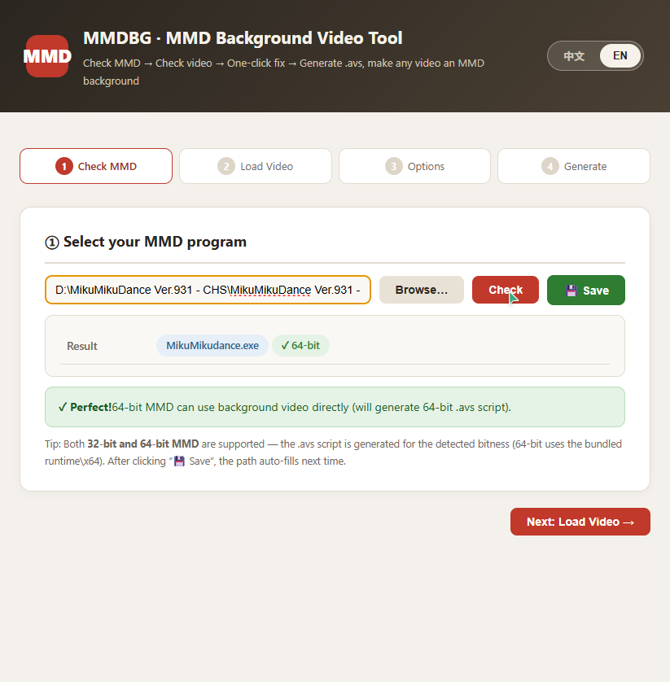
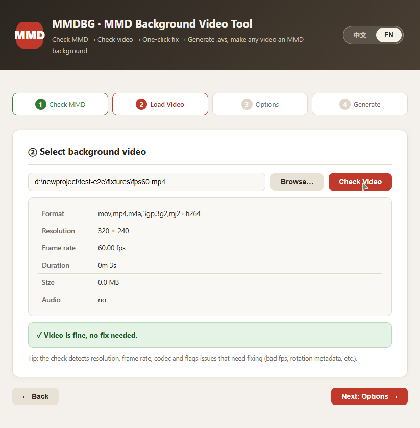
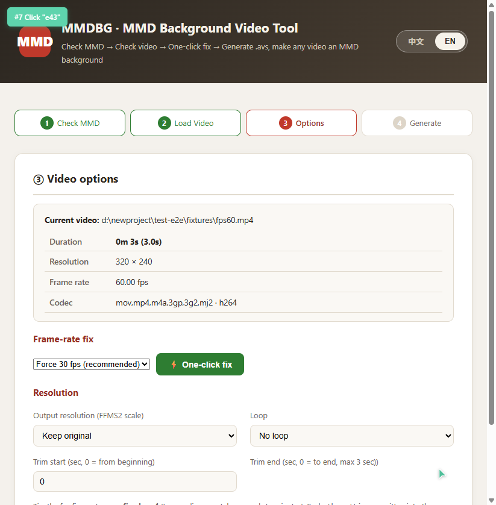
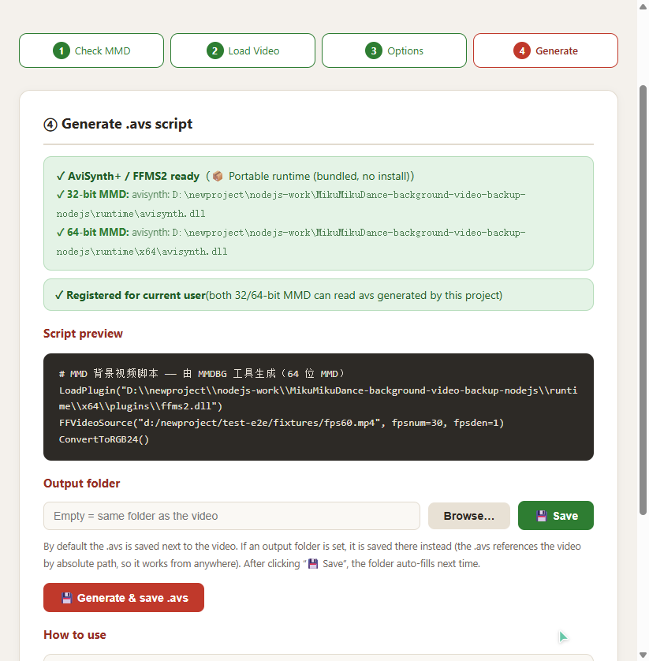
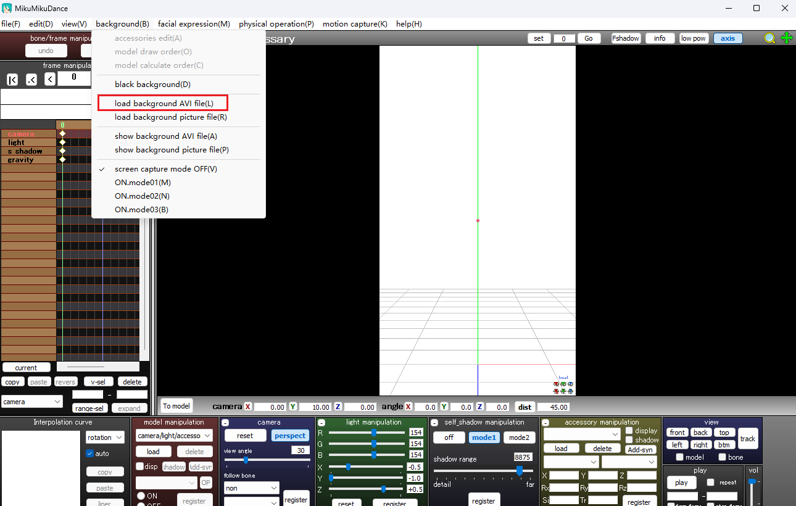
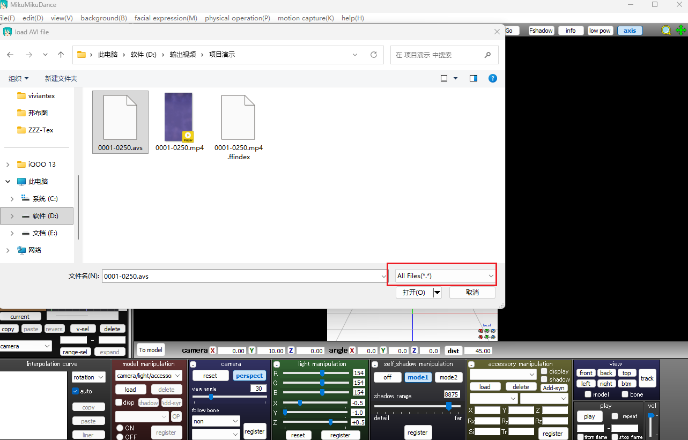
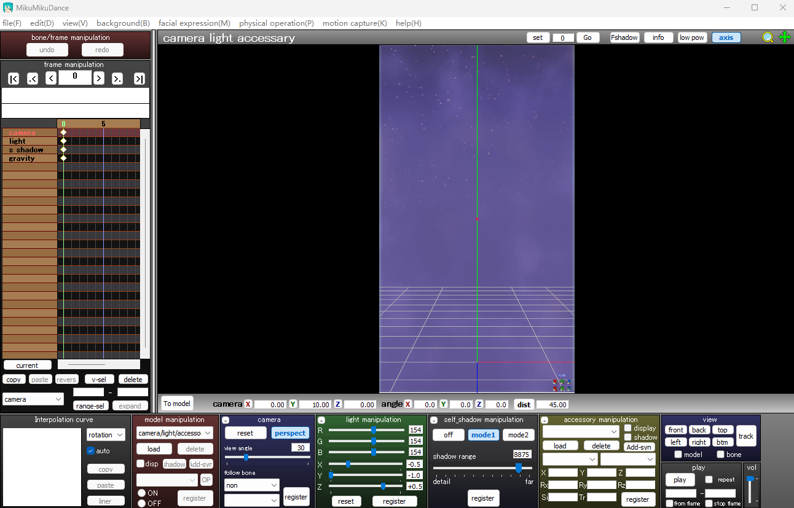

# MMDBG · MikuMikuDance Background Video

  

English | **[简体中文](README.md)**

A visual tool that lets MMD (MikuMikuDance) load **any video** (mp4 / mkv / avi / mov …) as a background.
Supports both **32-bit and 64-bit MMD**. Fully portable — unzip and run, zero dependencies.

## Screenshots

### ① Check MMD — auto-detects 32/64-bit



### ② Load Video — auto-detects format / resolution / frame-rate issues



### ③ Options — frame-rate fix / scaling / loop / trim



### ④ Generate .avs — runtime auto-selected by MMD bitness



### ⑤ Load in MMD — Background → Load background avi file



### ⑥ Select the .avs — switch file type to All Files (*.*) to see it



### ⑦ Done — the video shows up as the MMD background



## ✨ Fully Portable (unzip & run, zero dependencies)

This project **bundles a complete runtime** — end users need to **install nothing** (not even Node.js):

```
MikuMikuDance-background-video/
├── 启动工具.bat        ← double-click to launch (opens the browser UI)
├── server.mjs          Node.js backend
├── public/             visual UI (Chinese/English switch)
├── runtime/            ★ bundled portable runtime
│   ├── node/node.exe       Node.js v24 LTS official binary
│   ├── avisynth.dll        AviSynth+ 32-bit (VFW bridge, for 32-bit MMD)
│   ├── plugins/ffms2.dll   FFMS2 32-bit (FFmpeg decode engine)
│   └── x64/                ★ 64-bit MMD support
│       ├── avisynth.dll    AviSynth+ 64-bit (3.7.5)
│       └── plugins/ffms2.dll   FFMS2 64-bit (5.0)
├── licenses/
│   ├── GPL-3.0.txt     GPL v3 full text (runtime component licenses)
│   └── NODEJS-MIT.txt  Node.js MIT license
├── LICENSE             MIT (main code license)
└── THIRD-PARTY-NOTICES.md   third-party notices
```

**All you need:** either a 32-bit or 64-bit MMD. Unzip → double-click `启动工具.bat` → done.
(The launcher prefers the bundled node.exe and falls back to a system-installed Node.js if missing.)

On first launch the tool **automatically registers the portable runtime into the current user's registry**
(HKCU — no admin rights needed, 32/64-bit registered in one go). After that, MMD reads .avs files
directly through the bundled AviSynth+/FFMS2. **Delete the project folder for a complete uninstall** —
no system residue.

> Compatibility: if AviSynth+ is already installed system-wide, the tool detects it and still prefers
> the bundled version (controlled, consistent behavior); if the runtime folder is missing, it falls
> back to the system installation.

## Usage

1. **Double-click `启动工具.bat`** — starts the local server and opens the browser UI (http://127.0.0.1:38765)
2. **Step 1**: select your MMD program (.exe) → check bitness (32/64-bit both supported) → 💾 Save (auto-fills next time)
3. **Step 2**: select a background video → format / resolution / frame-rate / codec issues are detected automatically
4. **Step 3**: one-click frame-rate fix / scaling (with 2K/4K+ risk hints) / loop / trim
   > 💡 **Tip**: it is best to keep the video's output resolution identical to the resolution you plan to render your MMD video at (e.g. if you will render a 1080p final video, scale the background video to 1920×1080) — otherwise the background gets stretched or cropped, hurting image quality.
5. **Step 4**: generate .avs (runtime auto-selected by the MMD bitness from step 1) → in MMD: Background → Load background avi file → set file type to All Files

## Requirements

| Component | Notes |
|---|---|
| 32-bit or 64-bit MMD | either works (bitness checked in step 1, matching .avs generated) |
| Node.js | ✅ bundled (runtime/node/node.exe, no install) |
| AviSynth+/FFMS2 | ✅ bundled (runtime/ 32-bit + runtime/x64/ 64-bit, auto-registered) |

> ffmpeg/ffprobe are used for video probing and transcoding fixes. Either have ffmpeg available on
> the system PATH, or point to it via the `MMDBG_FFMPEG` / `MMDBG_FFPROBE` environment variables.

## FAQ

- **MMD fails to read / shows nothing for .avs**: make sure step 4 shows "registered"; if you ever cleaned the registry manually, click "Register" in the UI.
- **The .avs file is not visible in MMD's file dialog**: the file-type dropdown must be set to "All Files (*.*)".
- **Grey screen**: click "One-click frame-rate fix" first (phone-recorded videos often carry broken frame-rate metadata), then regenerate.
- **Switched to an MMD with a different bitness**: go back to step 1, re-check MMD, then regenerate the .avs (the LoadPlugin path inside the script is bitness-specific — 32/64-bit are not interchangeable).
- **FFMS2 bitness error**: for the x86 chain make sure runtime/plugins/ffms2.dll is the 32-bit build (v2.40; v5.0 is 64-bit only); for x64 make sure runtime/x64/plugins/ffms2.dll is the 64-bit build.

## Technical Notes

- **How it works**: MMD background video goes through the legacy VFW interface → AviSynth+ provides the VFW bridge → FFMS2 (FFmpeg) decodes any format.
- **Dual-bitness support**: the registry key `AVIFile\Extensions\AVS` is a shared view (written once); `CLSID` keys are redirected per bitness — the 64-bit native view points to `runtime\x64\avisynth.dll` (AviSynth+ 3.7.5 x64), the 32-bit Wow6432Node view points to `runtime\avisynth.dll` (x86). One registry structure lets 32-bit and 64-bit MMD each load the correct DLL without interference. The `LoadPlugin` line inside the .avs picks the matching ffms2.dll based on the MMD bitness detected in step 1.
- **Portable registration**: written to `HKCU\Software\Classes` (HKCU takes priority over HKLM when MMD reads it — no admin rights needed); uninstalling deletes the keys.
- **Config**: `mmdbg-config.json` stores the MMD path etc. (safe to delete).
- **Port**: defaults to 38765, override with the `MMDBG_PORT` environment variable (auto-increments if occupied).

## Authors

- **bilibili user: [我敲胡桃](https://space.bilibili.com/351710167)**
- **GLM-5.3** ([Z.ai](https://z.ai))

## License

| Part | License |
|---|---|
| Main code (server.mjs / public/ etc.) | [MIT License](LICENSE) |
| runtime/avisynth.dll ([AviSynth+](https://github.com/AviSynth/AviSynthPlus)) | [GNU GPL v3.0](licenses/GPL-3.0.txt) |
| runtime/plugins/ffms2.dll ([FFMS2](https://github.com/FFMS/ffms2)) | [GNU GPL v3.0](licenses/GPL-3.0.txt) |
| runtime/node/node.exe ([Node.js](https://nodejs.org) v24 LTS) | [MIT](licenses/NODEJS-MIT.txt) |

See [THIRD-PARTY-NOTICES.md](THIRD-PARTY-NOTICES.md) for details.
